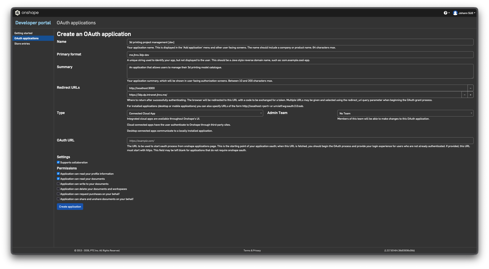

# Onshape integration setup

The Onshape integration lets users import models straight from an Onshape
document URL ("Sign in with Onshape"), re-sync them when the document changes
or pin an immutable version snapshot, and jump back via an "Edit in Onshape"
button. Enabling it requires registering an OAuth app once per deployment.

Navigate to the [Onshape developer portal](https://cad.onshape.com/appstore/dev-portal)
and create a new OAuth app as shown here:

## OAuth app configuration

Key fields when creating the app:

- **Redirect URLs** — must include the exact callback path, not just the
  origin. Add one entry per environment:
  - `https://<your-domain>/api/onshape/callback`
  - `http://localhost:3000/api/onshape/callback` (local dev)

  The app sends `{BETTER_AUTH_URL}/api/onshape/callback` as the
  `redirect_uri`. Onshape requires an exact match — registering only the bare
  origin (e.g. `https://your-domain.example.com/`) causes an `invalid_grant` /
  "ungültige Umleitungs-URL" error after login.

- **Type** — Connected Cloud App

## Environment variables

| Variable | Description |
|---|---|
| `ONSHAPE_CLIENT_ID` | OAuth app client ID from the developer portal |
| `ONSHAPE_CLIENT_SECRET` | OAuth app client secret |
| `BETTER_AUTH_URL` | Public base URL of the deployment (no trailing slash), e.g. `https://models.example.com`. Used to construct the redirect URI. |

The expected redirect URI for a given deployment is shown on the
`/settings/onshape` page in the app — copy it from there when registering or
updating the OAuth app.

## Troubleshooting

**`invalid_grant` / "Anwendung hat eine ungültige Umleitungs-URL
angefordert"** — The redirect URL sent by the app doesn't match any registered
URL. Check:

1. The Onshape OAuth app has `{BETTER_AUTH_URL}/api/onshape/callback` in its
   redirect URLs (not just the bare domain).
2. `BETTER_AUTH_URL` is set correctly in the deployment environment and
   matches the registered URL.
